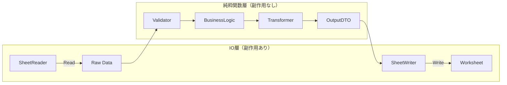
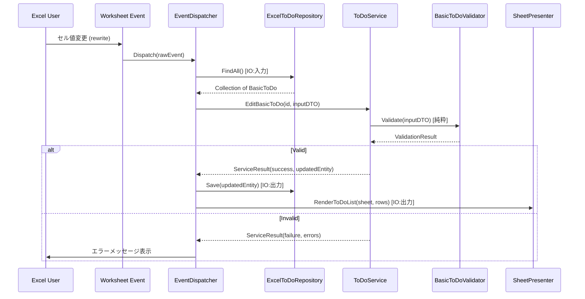

# myToDoSystem-VBA クラス設計書

OOP + FP ハイブリッド設計方針：**IOは処理の最初と最後に集約し、純粋関数によるビジネスロジックで副作用を排除する。**

---

## 設計の全体方針



| 層 | 責務 | 副作用 |
|---|---|---|
| **IO層（Boundary）** | Excelシート⇔データの読み書き | あり |
| **Entity層（Core）** | データの保持・生成・不変性の保証 | なし |
| **Validation層** | 入力値の検証、ルール適用 | なし |
| **Service層（UseCase）** | ビジネスロジックのオーケストレーション | なし |
| **Transformer層** | Entity→表示用DTO変換 | なし |

---

## 1. Entity層（不変データクラス）

各Entityはイミュータブルなデータ構造として定義。VBAではクラスモジュールで`Property Get`のみ公開し、初期化は`Init`ファクトリメソッドで行う。

### 1.1 マスターエンティティ

| クラス名 | PK | 主要属性 | FK (relatedTo) |
|---|---|---|---|
| `Client` | clientId (CL-000000) | clientName, generationDateAndTime | - |
| `Campaign` | campaignId (CP-000000) | campaignName, generationDateAndTime | client.clientId |
| `Milestone` | milestoneId (MS-000000) | milestoneName, generationDateAndTime | campaign.campaignId |
| `ToDoType` | toDoTypeId (TD-000000) | toDoTypeName, description | - |
| `Priority` | priorityId (PR-000000) | priorityTag, description | - |
| `EventType` | eventTypeId (ET-000000) | eventName, description | - |

### 1.2 休日エンティティ

| クラス名 | PK | 主要属性 | 備考 |
|---|---|---|---|
| `NationalHoliday` | date | description | 祝日 |
| `CompanyHoliday` | date | description | 会社休日 |
| `PersonalHoliday` | date | description | 個人休日 |

導出エンティティ:
- `NonPersonalHolidays` = Union(NationalHolidays, CompanyHolidays)
- `AllTheHolidays` = Union(NonPersonalHolidays, PersonalHolidays)

### 1.3 トランザクションエンティティ

| クラス名 | PK | 主要属性 | FK |
|---|---|---|---|
| `BasicToDo` | basicToDoId (BT-000000) | toDoName, scheduledExecutionDate, scheduledExecutionTime, deadlineDateAndTime, estimatedExecutionalDuration, scheduledResttimeDuration, actualBeginningTime, actualFinishTime, generationDateAndTime | milestoneId, toDoTypeId, priorityId |
| `RepeatToDoPrototype` | repPrototypeId (RP-000000) | defaultToDoName, defaultScheduledExecutionTime, defaultSpanUntilDeadline, defaultEstimatedExecutionalDuration, defaultScheduledResttimeDuration, generationDateAndTime | defaultMilestoneId, defaultToDoTypeId, defaultPriorityId |
| `RepeatToDoInstance` | repInstanceId (RI-000000) | toDoName, scheduledExecutionDate, scheduledExecutionTime, deadlineDateAndTime, estimatedExecutionalDuration, scheduledResttimeDuration, actualBeginningTime, actualFinishTime, generationDateAndTime, isUnique | repPrototypeId, milestoneId, toDoTypeId, priorityId |
| `RawEvent` | eventId (RE-000000) | sheet, listObject, target, generationDateAndTime | eventTypeId |

---

## 2. Validation層（純粋関数）

バリデーションは**純粋関数**として実装。`ValidationResult`を返し、副作用（メッセージボックス等）は呼び出し元で処理する。

### 2.1 ValidationResult（値オブジェクト）

```
Class ValidationResult
  Property Get IsValid As Boolean
  Property Get Errors As Collection  ' of String
  Function Merge(other As ValidationResult) As ValidationResult  ' 複数結果の合成
End Class
```

### 2.2 バリデーションルール関数群（標準モジュール）

```
Module ValidationRules
  ' 文字列バリデーション
  Function ValidateString(value, acceptEmpty, minLen, maxLen, avoidChars(), format) As ValidationResult
  
  ' ID（PK）バリデーション — 重複チェックは別（IO必要）
  Function ValidateIdFormat(value, format, expectedLength) As ValidationResult
  
  ' 日付バリデーション
  Function ValidateDate(value, acceptNull, format, minDate, maxDate) As ValidationResult
  
  ' 時刻バリデーション
  Function ValidateTime(value, acceptNull, format, minTime, maxTime) As ValidationResult
  
  ' 日時バリデーション
  Function ValidateDateTime(value, acceptNull, format, minDate, maxDate, minTime, maxTime) As ValidationResult
  
  ' 数値バリデーション
  Function ValidateNumber(value, acceptNull, min, max) As ValidationResult
  
  ' ブーリアンバリデーション
  Function ValidateBoolean(value, acceptNull) As ValidationResult
End Module
```

### 2.3 エンティティ別バリデータ（標準モジュール）

各エンティティ用に個別関数を合成して1つのバリデーション関数を構築。

```
Module BasicToDoValidator
  Function Validate(dto As BasicToDoInputDTO) As ValidationResult
    ' 全フィールドのルール関数を呼び出し → Merge で結合
  End Function
End Module
```

> 同様に `RepeatToDoInstanceValidator`, `ClientValidator` 等を用意。

---

## 3. Service層（ユースケース・オーケストレーション）

**純粋ロジック**部分を担当。IOは注入された`Repository`経由で抽象化。

### 3.1 メインサービス

```
Class ToDoService
  ' --- 依存注入 ---
  Property Set BasicToDoRepository(repo As IToDoRepository)
  Property Set RepeatToDoRepository(repo As IRepeatToDoRepository)
  Property Set HolidayRepository(repo As IHolidayRepository)
  
  ' --- BasicToDo CRUD ---
  Function AddBasicToDo(input As BasicToDoInputDTO) As ServiceResult
  Function EditBasicToDo(toDoId As String, input As BasicToDoInputDTO) As ServiceResult
  Function DoneBasicToDo(toDoId As String, finishTime As Date) As ServiceResult
  Function DuplicateBasicToDo(toDoId As String) As ServiceResult
  Function DeleteBasicToDo(toDoId As String) As ServiceResult

  ' --- RepeatToDo CRUD ---
  Function AddRepeatToDo(input As RepeatToDoInputDTO) As ServiceResult
  Function EditRepeatToDo(instanceId As String, input As RepeatToDoInputDTO) As ServiceResult
  Function DoneRepeatToDo(instanceId As String, finishTime As Date) As ServiceResult
  Function DuplicateRepeatToDo(instanceId As String) As ServiceResult
  Function DeleteRepeatToDo(instanceId As String) As ServiceResult
End Class
```

### 3.2 表示系サービス

```
Class DisplayService
  Function BuildTodayToDoList(allToDos As Collection, today As Date) As Collection ' of ToDoRowDTO
  Function BuildTomorrowToDoList(allToDos As Collection, ..., holidays As Collection) As Collection
  Function BuildSpecificDayToDoList(allToDos As Collection, targetDate As Date) As Collection
  Function BuildTwoWeekScheduleCalendar(allToDos As Collection, startDate As Date) As Collection ' of DayScheduleDTO
  Function BuildDailyExecutedTaskTime(allToDos As Collection, yearMonth As Date, granularity As String) As Collection ' of ExecutedTaskRowDTO
End Class
```

> **次の就業日**は「全休日を除いた翌営業日」を算出する純粋関数で求める:
> `Function GetNextWorkDay(today As Date, holidays As Collection) As Date`

---

## 4. IO層（副作用をここに集約）

### 4.1 Repository インターフェース

```
' === IToDoRepository ===
Interface IToDoRepository
  Function FindAll() As Collection
  Function FindById(id As String) As BasicToDo
  Function Save(entity As BasicToDo) As Boolean
  Function Delete(id As String) As Boolean
  Function GenerateNewId() As String
End Interface
```

同様に `IRepeatToDoRepository`, `IHolidayRepository`, `IMasterRepository` を定義。

### 4.2 Excel実装

```
Class ExcelToDoRepository  ' Implements IToDoRepository
  ' ListObjectからBasicToDoコレクションを読み込み
  ' ListObjectへBasicToDoを書き込み
End Class
```

### 4.3 SheetPresenter（出力専用）

```
Class SheetPresenter
  Sub RenderToDoList(sheet As Worksheet, rows As Collection) ' of ToDoRowDTO
  Sub RenderTwoWeekCalendar(sheet As Worksheet, schedule As Collection)
  Sub RenderExecutedTaskSummary(sheet As Worksheet, summary As Collection)
End Class
```

---

## 5. DTO（Data Transfer Object）

IO⇔Service間のデータ受け渡しに使用。Entityとは別に「画面の列構成」に対応する構造体。

### 5.1 入力DTO

```
Class BasicToDoInputDTO
  Property Get CampaignName As String
  Property Get MilestoneName As String
  Property Get ToDoName As String
  Property Get ToDoTypeName As String
  Property Get ScheduledExecutionTime As Date
  Property Get EstimatedExecutionalDuration As Date
  Property Get ScheduledResttimeDuration As Date
  Property Get DeadlineDateAndTime As Date
  Property Get Priority As String
  Property Get ScheduledExecutionDate As Date
End Class
```

### 5.2 出力DTO — ToDoテーブル行

```
Class ToDoRowDTO
  ' IOTableDesignの列構成と一致
  Property Get ToDoId As String
  Property Get ClientName As String
  Property Get CampaignName As String
  Property Get MilestoneName As String
  Property Get ToDoName As String
  Property Get ToDoTypeName As String
  Property Get ScheduledExecutionTime As String
  Property Get EstimatedExecutionalDuration As String
  Property Get ScheduledResttimeDuration As String
  Property Get DeadlineDateAndTime As String
  Property Get ActualBeginningTime As String
  Property Get ActualFinishTime As String
  Property Get Priority As String
  Property Get ScheduledExecutionDate As String
End Class
```

### 5.3 出力DTO — スケジュールカレンダー

```
Class DayScheduleDTO
  Property Get DateValue As Date
  Property Get TimeSlots() As Collection  ' 6:00~23:55 (5分刻み) の各セル情報
End Class
```

### 5.4 出力DTO — 実行済みタスク集計

```
Class ExecutedTaskRowDTO
  Property Get Id As String       ' 粒度に応じたID (Client/Campaign/Milestone)
  Property Get Name As String     ' 粒度に応じた名前
  Property Get DailyMinutes(dayIndex As Long) As Double  ' 日付01~31の実所要時間
End Class
```

---

## 6. EventDispatcher（IOイベントのルーティング）

ユーザー操作（doubleClick / rewrite）を受けて適切なServiceメソッドを呼び出すコントローラー。

```
Class EventDispatcher
  ' Worksheet_Change / Worksheet_BeforeDoubleClick から呼ばれるエントリポイント
  Sub Dispatch(event As RawEvent)
    ' 1. EventTypeに基づいてルーティング
    ' 2. IO層で必要なデータを読み込み（Repository経由）
    ' 3. Service層で純粋処理
    ' 4. IO層で結果を書き込み（Presenter経由）
  End Sub
End Class
```

---

## 7. 処理フロー全体像（例: editBasicToDo）



---

## 8. ファイル構成案

```
src/
├── Entity/               ' 不変データクラス
│   ├── Client.cls
│   ├── Campaign.cls
│   ├── Milestone.cls
│   ├── ToDoType.cls
│   ├── Priority.cls
│   ├── BasicToDo.cls
│   ├── RepeatToDoPrototype.cls
│   ├── RepeatToDoInstance.cls
│   ├── RawEvent.cls
│   └── Holidays.cls       ' NationalHoliday, CompanyHoliday, PersonalHoliday を統合
│
├── DTO/                   ' IO用データ転送オブジェクト
│   ├── BasicToDoInputDTO.cls
│   ├── RepeatToDoInputDTO.cls
│   ├── ToDoRowDTO.cls
│   ├── DayScheduleDTO.cls
│   └── ExecutedTaskRowDTO.cls
│
├── Validation/            ' 純粋関数群
│   ├── ValidationResult.cls
│   ├── ValidationRules.bas    ' 汎用ルール関数
│   ├── BasicToDoValidator.bas
│   ├── RepeatToDoValidator.bas
│   └── MasterValidator.bas
│
├── Service/               ' ビジネスロジック（純粋）
│   ├── ToDoService.cls
│   ├── DisplayService.cls
│   └── HolidayService.bas    ' GetNextWorkDay 等
│
├── Repository/            ' IO層（Data Access）
│   ├── IToDoRepository.cls       ' Interface
│   ├── IRepeatToDoRepository.cls
│   ├── IHolidayRepository.cls
│   ├── IMasterRepository.cls
│   ├── ExcelToDoRepository.cls
│   ├── ExcelRepeatToDoRepository.cls
│   ├── ExcelHolidayRepository.cls
│   └── ExcelMasterRepository.cls
│
├── Presenter/             ' IO層（Output）
│   └── SheetPresenter.cls
│
├── Controller/            ' イベントルーティング
│   └── EventDispatcher.cls
│
└── Common/                ' ユーティリティ
    ├── IdGenerator.bas
    └── DateTimeHelper.bas
```

---

## 9. 設計のポイントまとめ

| 原則 | 実現方法 |
|---|---|
| **IO集約** | Repository/Presenterに全IO操作を閉じ込め、Service層は純粋 |
| **不変性** | Entity は `Property Get` のみ。変更時は新インスタンスを生成 |
| **純粋関数** | Validation, Service, Transformer は外部状態に依存しない |
| **合成可能** | ValidationResultの`Merge`で小さいルール関数を合成 |
| **テスト容易** | Service/Validationは単体テスト可能（IOモックで注入） |
| **依存逆転** | RepositoryをInterface化し、Service→Interface→Excel実装 |
