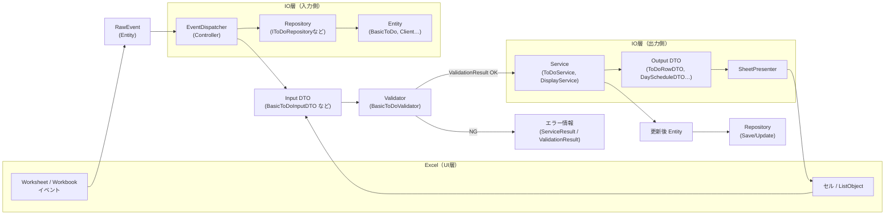

 - mermaidファイル

```mermaid
flowchart LR
    subgraph Excel["Excel（UI層）"]
        WS["Worksheet / Workbook\nイベント"]
        Sheet["セル / ListObject"]
    end

    WS --> RE["RawEvent\n(Entity)"]

    RE --> ED["EventDispatcher\n(Controller)"]

    subgraph IO_In["IO層（入力側）"]
        ED --> RepoI["Repository\n(IToDoRepositoryなど)"]
        RepoI --> Ent["Entity\n(BasicToDo, Client…)"]
    end

    ED --> DTOin["Input DTO\n(BasicToDoInputDTO など)"]
    Sheet --> DTOin

    DTOin --> Val["Validator\n(BasicToDoValidator)"]
    Val -->|ValidationResult OK| Svc["Service\n(ToDoService, DisplayService)"]
    Val -->|NG| Err["エラー情報\n(ServiceResult / ValidationResult)"]

    Svc --> Ent2["更新後 Entity"]
    Ent2 --> RepoS["Repository\n(Save/Update)"]

    subgraph IO_Out["IO層（出力側）"]
        Svc --> DTOout["Output DTO\n(ToDoRowDTO, DayScheduleDTO…)"]
        DTOout --> Pres["SheetPresenter"]
        Pres --> Sheet
    end
```