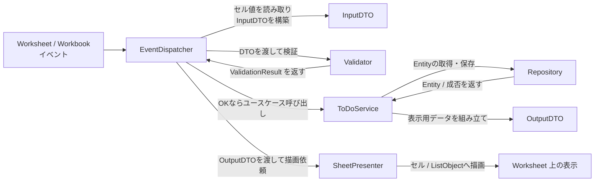

```mermaid
flowchart LR
    WS["Worksheet / Workbook\nイベント"] --> ED["EventDispatcher"]

    ED -->|"セル値を読み取り\nInputDTOを構築"| DTOin["InputDTO"]
    ED -->|"DTOを渡して検証"| Val["Validator"]
    Val -->|"ValidationResult を返す"| ED

    ED -->|"OKならユースケース呼び出し"| Svc["ToDoService"]
    Svc -->|"Entityの取得・保存"| Repo["Repository"]
    Repo -->|"Entity / 成否を返す"| Svc

    Svc -->|"表示用データを組み立て"| DTOout["OutputDTO"]
    ED -->|"OutputDTOを渡して描画依頼"| Pres["SheetPresenter"]
    Pres -->|"セル / ListObjectへ描画"| Sheet["Worksheet 上の表示"]
```

