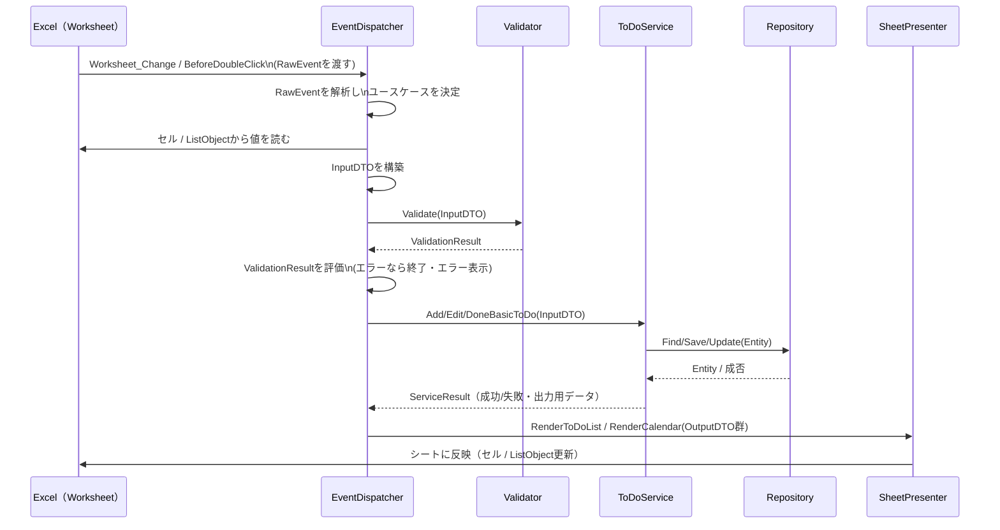

```mermaid
sequenceDiagram
    participant Excel as Excel（Worksheet）
    participant ED as EventDispatcher
    participant Val as Validator
    participant Svc as ToDoService
    participant Repo as Repository
    participant Pres as SheetPresenter

    Excel->>ED: Worksheet_Change / BeforeDoubleClick\n(RawEventを渡す)
    ED->>ED: RawEventを解析し\nユースケースを決定

    ED->>Excel: セル / ListObjectから値を読む
    ED->>ED: InputDTOを構築

    ED->>Val: Validate(InputDTO)
    Val-->>ED: ValidationResult

    ED->>ED: ValidationResultを評価\n(エラーなら終了・エラー表示)

    ED->>Svc: Add/Edit/DoneBasicToDo(InputDTO)
    Svc->>Repo: Find/Save/Update(Entity)
    Repo-->>Svc: Entity / 成否
    Svc-->>ED: ServiceResult（成功/失敗・出力用データ）

    ED->>Pres: RenderToDoList / RenderCalendar(OutputDTO群)
    Pres->>Excel: シートに反映（セル / ListObject更新）
```

